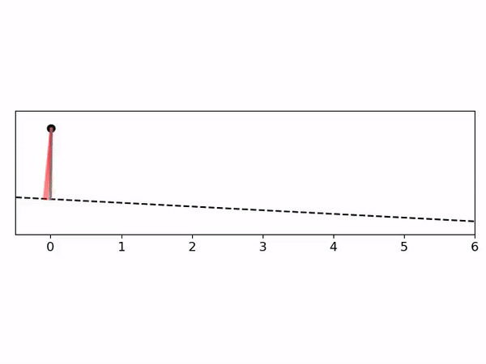

# learning-hcbfs
Code needed to replicate the examples from "[Learning Hybrid Control Barrier Functions from Data](https://github.com/unstable-zeros/learning-hcbfs/blob/main/Learning%20Hybrid%20Control%20Barrier%20Functions%20from%20Data.pdf)" by L. Lindemann, H. Hu, A. Robey, H. Zhang, D. V. Dimarogonas, S. Tu, and N. Matni, to appear at CoRL 2020.  See [here](https://drive.google.com/file/d/1YWI-r4Qop_3D0KIOJ8ZU8NAm9bzD59lK/view?usp=sharing) for a short 15min video about our work!

Code for the bouncing ball case study can be found [here](https://github.com/unstable-zeros/learning-hcbfs/tree/main/bouncing_ball_for_share).

Code for the compass gait case study can be found [here](https://github.com/unstable-zeros/learning-hcbfs/tree/main/compass-gait).

    

