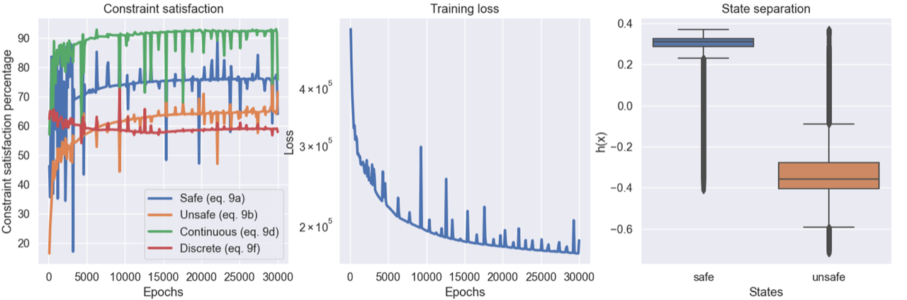

# Compass gait case study

<figure class="video_container">
  <video controls="true" allowfullscreen="true">
    <source src="assets/out-cbf.mp4" type="video/mp4">
  </video>
</figure>

This repository contains the code necessary for reproducing the experiment concerning the compass gait walker in our recent paper **Learning Hybrid Control Barrier Functions From Data**, which appeared at CORL 2020.  If you find this code useful in your own research, please consider citing:

```latex
@article{lindemann2020learning,
  title={Learning Hybrid Control Barrier Functions from Data},
  author={Lindemann, Lars and Hu, Haimin and Robey, Alexander and Zhang, Hanwen and Dimarogonas, Dimos V and Tu, Stephen and Matni, Nikolai},
  journal={arXiv preprint arXiv:2011.04112},
  year={2020}
}
```

## Requirements

This program requires Python >= 3.7 and [Jax](https://github.com/google/jax); all experiments for the compass gait walker were run using the [Jax build with GPU support](https://github.com/google/jax#pip-installation).  Further, this repository requires the requirements in the `requirements.txt` file.  To build a virtual environment containing these dependencies, one option is to use conda:

```bash
conda create -n hcbfenv python=3.7
conda activate hcbfenv
pip3 install -r requirements.txt
```

Note that Jax is not included in `requirements.txt` to allow users to download the relevant builds.

## Collecting expert trajectories

To collect expert trajectories using the compass gait walker, you can run the following bash script:

```bash
chmod +x collect_data.sh
./collect_data.sh
```

To select the path dame of the dataset to be saved, you can edit the following environmental variables:

```bash
export SAVE_DATA_PATH=./
export DATASET_NAME=rollouts.pkl
```

### Selecting a method for collecting expert rollouts

There are two different kinds of rollouts that can be collected: rollouts from i.i.d. initial conditions (denoted by 'iid') and perturbed rollouts, where we collect a rollout from one initial condition and then perturb the control actions used in this first rollout.  This second option is denoted by 'pert'.  

```bash
export ROLLOUT_TYPE='pert'
```

In the results in our paper, we used the 'pert' setting to collect 100 iid rollouts, and we generated four perturbed copies for each of these rollouts.  To set the number of rollouts that are collected, you can use the following variables.  For example, in the paper we used:

```bash
export N_ROLLOUTS=100
export N_PERTURB_ROLLOUTS=4
```

### Parameters for each expert rollout

To set the time step Δt and the horizon for each rollout, you can set:

```bash
export HORIZON=750
export DELTA_T=0.01
```

Both of these values are the ones that we used in the paper. 

Finally, in each rollout, the number of steps taken by the walker is our main metric of how well the walker performs.  Thus, to define an expert trajectory, we use a threshold based on the number of steps taken by the expertly-controlled walker.  That is, we only save expert trajectories in which the walker travels more than or equal to a fixed number of steps.  To adjust this number of steps, you can set:

```bash
export SUCCESS_N_STEPS=8
```

For these settings for `HORIZON`, `DELTA_T`, and `SUCCESS_N_STEPS`, the walker will travel between 0 and 11 steps.  
 

### Selecting an expert controller

You can also select a particular form of the expert controller.  We have provided three options: 'energy', which creates an energy-based controller from Spong et al. (1997), 'zero': which creates a controller that always returns zero, and 'noisy', which creates a controller that returns random noise.

```bash
export NOMINAL_CTRL='energy'
```

In our paper, we used the 'energy' controller.


## Training a hybrid control barrier function

To train a hybrid control barrier function (HCBF) from expert trajectories, you can run the following bash script:

```bash
chmod +x train.sh
./train.sh
```

To select the dataset (which can be obtained by running `collect_data.sh`), you can set

```bash
export TRAINING_DATA=./{my-dataset-name}.pkl
```

You can also select the number of rollouts to use from this dataset by setting the following:

```bash
export N_TRAIN_ROLLOUTS=500
```

Further, you can set the path to which all of the output data and figures will be saved to by setting the following path:

```bash
export RESULTS_DIR=./results
```

### Hyperparameters and architecture selection

You can set the dimensions of the neural network using the following flag:

```bash
export NET_DIMS=(4 32 16 1)
```

This flag must be a tuple of integers; the first integer must be 4 (equal to the dimension of the state) and the last integer must be 1 (as hybrid control barrier functions are real-valued).  The other integers represent the sizes of the intermediate layers in the feed-forward neural network architecture for h(x).

To set the number of training epochs, you can set:

```bash
export N_EPOCHS=30000
```

To set any of the hyperparameters discussed in the text, you can set:

```bash
# Lagrange multipliers/coefficients
export LAMBDA_SAFE=5.0          # eq. 9a
export LAMBDA_UNSAFE=10.0       # eq. 9b
export LAMBDA_CONT=0.2          # eq. 9d
export LAMBDA_DISCRETE=0.2      # eq. 9f
export LAMBDA_GRAD=0.01
export LAMBDA_PARAM=1.0

# Loss margin hyperparameters
export GAMMA_SAFE=0.3           # eq. 9a
export GAMMA_UNSAFE=0.3         # eq. 9b
export GAMMA_CONT=0.05          # eq. 9d
export GAMMA_DISCRETE=0.05      # eq. 9f
```

Finally, you can set the parameters used for the NUTS neighbor sampling algorithm used to identify boundary states by setting the following:

```bash
export MIN_NUM_NBRS=200
export NBR_THRESH=0.04
```

### Figures

As the HCBF trains, a figure showing the current loss and constraint satisfaction rates will be saved in the `RESULTS_DIR` directory.  This should look something like the following:



After training completes, the program will look for a trajectory for which the 